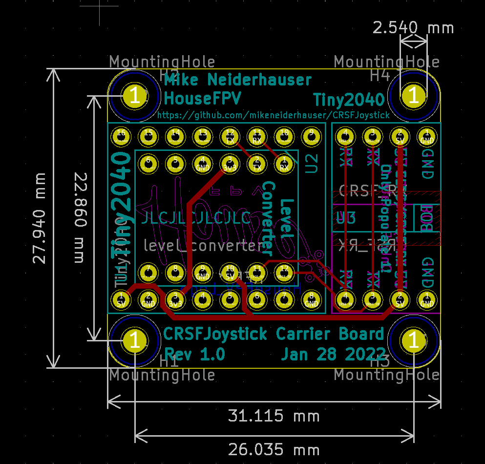
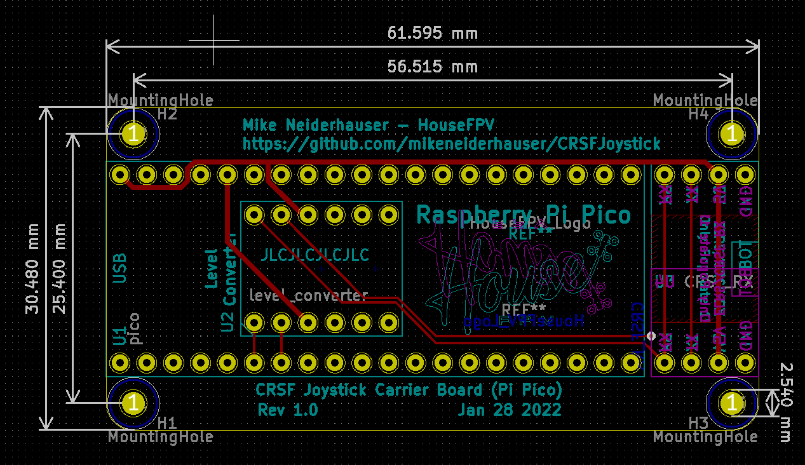

# CRSFJoystick
Arduino code using the mbed core that runs on a Pi Pico (2040) to emulate a USB HID Joystick

Pirmarily developed to use and ExpressLRS receiver and a HID Joystick for Sim use!

Shout out to CapnBry for the Crsf Library

https://github.com/CapnBry/CRServoF

Shout out to RealRobots.net for the Gamepad Library

https://gitlab.com/realrobots/PicoGamepad/-/tree/master

# Usage
Tested with arduino-1.8.19.

Go to Boards manager and install 'Arduino Mbed OS RP2040 Boards' package.  I'm using version 2.6.1 currently.

Update the arduino ide preferences to point to the Sketchbook folder contained by this repo.  Libraries and examples are already included.

Compile and upload. 

On first upload to the pico, you will need to hold in the bootsel buttion before plugging it into the computer.  This should only have to be done once and subsequent uppdates can be done automatically by the ide.

Once uploaded, the device should be recgonzed by your computer as a HID Joystick.

# Mappings
This was a quick map and is not fully featured.

On link up/down the onboard Pi Pico LED will light indicating connection

*NOTE* Channel 5, 6, 7, and 8 are mapped both to analog axis as well as joystick buttons.

| Channel     | Logical Mapping  | Joystick Mapping |
| ----------- | ---------------- | ---------------- |
| 1           | A                | X                |
| 2           | E                | Y                |
| 3           | T                | Rx               |
| 4           | R                | Ry               |
| 5           | Channel 5 (Full) AND AUX1 (1510-2011) | Z  AND Button 0 |
| 6           | Channel 6 (Full) AND AUX2 (1510-2011) | Rz AND Button 1 |
| 7           | Channel 7 (Full) AND AUX3 (1510-2011) | S0 AND Button 2 |
| 8           | Channel 8 (Full) AND AUX4 (1510-2001) | S1 AND Button 3 |
| 9           | AUX5 (1510-2011) | Button 4         |
| 10          | AUX6 (1510-2011) | Button 5         |
| 11          | AUX7 (1510-2011) | Button 6         |
| 12          | AUX8 (1510-2011) | Button 7         |
| 13          | Not Used         | Not Used         |
| 14          | Not Used         | Not Used         |
| 15          | LQ - Not Used    | Not Used         |
| 16          | RSSI - Not Used  | Not Used         |

*Note additional button mappings can be created in caliration.h*

# Hardware

| Part  | Link | Approx Cost |
| ----- | ---- | ------------|
| Pi Pico | https://www.pishop.us/product/raspberry-pi-pico/ | $4 (Approx $6 with shipping) |
| Tiny 2040 (alt part) | https://www.pishop.us/product/tiny-2040/ | $10 (Approx $12 with shipping) |
| ELRS RX (any will do) |  https://www.racedayquads.com/products/happymodel-2-4ghz-ep1-rx-express-lrs-receiver?_pos=1&_sid=c7214d987&_ss=r | $13.50 |
| Level Shifter (Used for prototype boards) | https://www.amazon.com/dp/B07F7W91LC?psc=1&ref=ppx_yo2_dt_b_product_details | 10 for $7.50 ($0.75 ea) |

Approx part cost for pico hardware (large footprint, cheaper) - $20-$25

- Pi Pico - $4.00
- ELRS RX - $13.50 
- Level Shifter - $0.75
- Carrier Board - $1.00 (approx)
- Shipping / Tax from vendors - varies

Approx part cost for tiny2040 hardware (much smaller footprint) - $25-$30

- Tiny2040 - $10.00
- ELRS RX - $13.50 
- Level Shifter - $0.75
- Carrier Board - $1.00 (approx)
- Shipping / Tax from vendors - varies

# Carrier Boards (Tiny Version)

Hardware build files are located in hardware/kicad/CRSFJoystick/output/Rev1.0

I used JLCPCB with Black Soldermask and a board thickness of 1.6mm.

Note the different orientation of the ELRS RX's.  The orientation can be flipped.  I installed each RX to ensure the boot pad is exposed should the RX need recovered.

## Tiny2040

## Raspberry Pi Pico (Full Version)

# Future Plans

- Convert from Arduino IDE to platform.io
- Add failsafe nopulses / hold
- design enclosure
- TBD other features

# Demo Video

