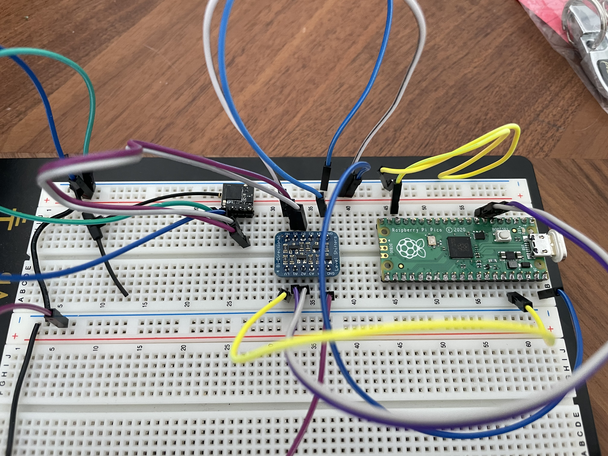

# CRSFJoystick
Arduino code using the mbed core that runs on a Pi Pico (2040) to emulate a USB HID Joystick

Pirmarily developed to use and ExpressLRS receiver and a HID Joystick for Sim use!

Shout out to CapnBry for the Crsf Library

https://github.com/CapnBry/CRServoF

Shout out to RealRobots.net for the Gamepad Library

https://gitlab.com/realrobots/PicoGamepad/-/tree/master

# Mappings
This was a quick map and is not fully featured.

On link up/down the onboard Pi Pico LED will light indicating connection

| Channel     | Logical Mapping | Joystick Mapping |
| ----------- | --------------- | ---------------- |
| 1           | A               | X                |
| 2           | E               | Y                |
| 3           | T               | Z                |
| 4           | R               | Rx               |
| 5           | AUX1 (1 bit)    | Button 0         |
| 6           | AUX2 (1 bit)    | Button 1         |
| 7           | AUX3 (1 bit)    | Button 2         |
| 8           | AUX4 (1 bit)    | Button 3         |
| 9           | AUX5 (1 bit)    | Button 4         |
| 10          | AUX6 (1 bit)    | Button 5         |
| 11          | AUX7 (1 bit)    | Button 6         |
| 12          | AUX8 (1 bit)    | Button 7         |
| 13          | Not Used        | Not Used         |
| 14          | Not Used        | Not Used         |
| 15          | LQ - Not Used   | Not Used         |
| 16          | RSSI - Not Used | Not Used         |

# Hardware

| Part  | Link | Approx Cost |
| ----- | ---- | ------------|
| Pi Pico | https://www.pishop.us/product/raspberry-pi-pico/ | $4 |
| Tiny 2040 (alt part) | https://www.pishop.us/product/tiny-2040/ | $10 |
| ELRS RX (any will do) |  https://www.racedayquads.com/products/happymodel-2-4ghz-ep1-rx-express-lrs-receiver?_pos=1&_sid=c7214d987&_ss=r | $13.50 |
| Level Shifter (what I had on hand) | https://www.adafruit.com/product/757 | $4 |

Approx part cost $22

# Prototype Photos

