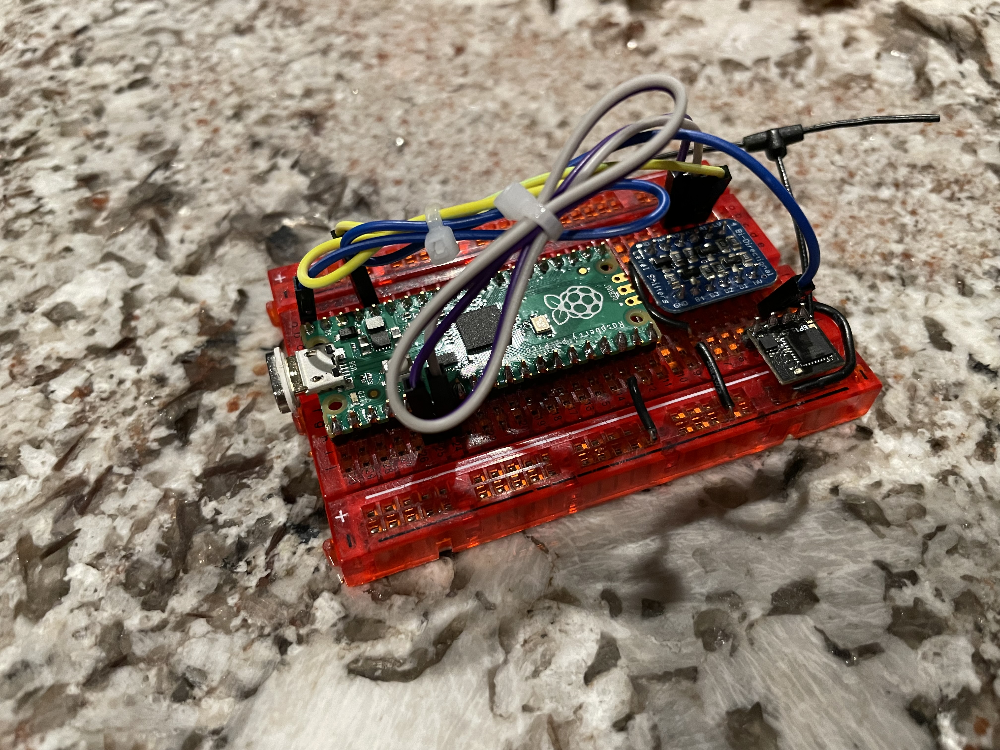

# CRSFJoystick
Arduino code using the mbed core that runs on a Pi Pico (2040) to emulate a USB HID Joystick

Pirmarily developed to use and ExpressLRS receiver and a HID Joystick for Sim use!

Shout out to CapnBry for the Crsf Library

https://github.com/CapnBry/CRServoF

Shout out to RealRobots.net for the Gamepad Library

https://gitlab.com/realrobots/PicoGamepad/-/tree/master

# Usage
Tested with arduino-1.8.19.

Go to Boards manager and install 'Arduino Mbed OS RP2040 Boards' package.  I'm using version 2.6.1 currently.

Update the arduino ide preferences to point to the Sketchbook folder contained by this repo.  Libraries and examples are already included.

Compile and upload. 

On first upload to the pico, you will need to hold in the bootsel buttion before plugging it into the computer.  This should only have to be done once and subsequent uppdates can be done automatically by the ide.

Once uploaded, the device should be recgonzed by your computer as a HID Joystick.

# Mappings
This was a quick map and is not fully featured.

On link up/down the onboard Pi Pico LED will light indicating connection

| Channel     | Logical Mapping  | Joystick Mapping |
| ----------- | ---------------- | ---------------- |
| 1           | A                | X                |
| 2           | E                | Y                |
| 3           | T                | Z                |
| 4           | R                | Rx               |
| 5           | AUX1 (1510-2011) | Button 0         |
| 6           | AUX2 (1510-2011) | Button 1         |
| 7           | AUX3 (1510-2011) | Button 2         |
| 8           | AUX4 (1510-2011) | Button 3         |
| 9           | AUX5 (1510-2011) | Button 4         |
| 10          | AUX6 (1510-2011) | Button 5         |
| 11          | AUX7 (1510-2011) | Button 6         |
| 12          | AUX8 (1510-2011) | Button 7         |
| 13          | Not Used         | Not Used         |
| 14          | Not Used         | Not Used         |
| 15          | LQ - Not Used    | Not Used         |
| 16          | RSSI - Not Used  | Not Used         |

*Note additional button mappings can be created in caliration.h*

# Hardware

| Part  | Link | Approx Cost |
| ----- | ---- | ------------|
| Pi Pico | https://www.pishop.us/product/raspberry-pi-pico/ | $4 |
| Tiny 2040 (alt part) | https://www.pishop.us/product/tiny-2040/ | $10 |
| ELRS RX (any will do) |  https://www.racedayquads.com/products/happymodel-2-4ghz-ep1-rx-express-lrs-receiver?_pos=1&_sid=c7214d987&_ss=r | $13.50 |
| Level Shifter (what I had on hand) | https://www.adafruit.com/product/757 | $4 |
| Level Shifter (alt part) | https://www.aliexpress.com/item/1972789887.html?spm=a2g0o.productlist.0.0.5c50769dtUDJLs&algo_pvid=ac5a3bf0-d505-4a7b-ad5d-90b0f2860eaf&algo_exp_id=ac5a3bf0-d505-4a7b-ad5d-90b0f2860eaf-0&pdp_ext_f=%7B%22sku_id%22%3A%2212000022963323570%22%7D&pdp_pi=-1%3B1.5%3B-1%3B-1%40salePrice%3BUSD%3Bsearch-mainSearch| 10 for $3 |

Approx part cost $22

# Wiring

Should be self explanitory, but using GPIO 4/5 (physical pin 6/7) on the pi pico for UART to ELRS RX.  UART from pi pico is fed through a level converter to the ELRS RX.

Most other wiring is for HV (5V) and LV (3V) and GND pins.

# Future Plans

- Convert from Arduino IDE to platform.io
- Add failsafe nopulses / hold
- design hardware carrier board
- design enclosure
- use Tiny 2040 instead of full pi pico
- TBD other features

# Prototype Photos

